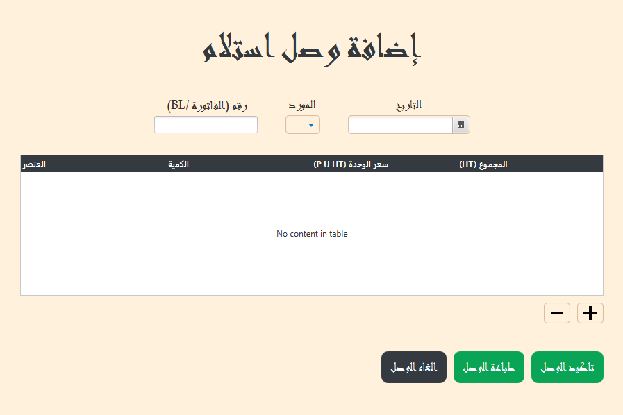
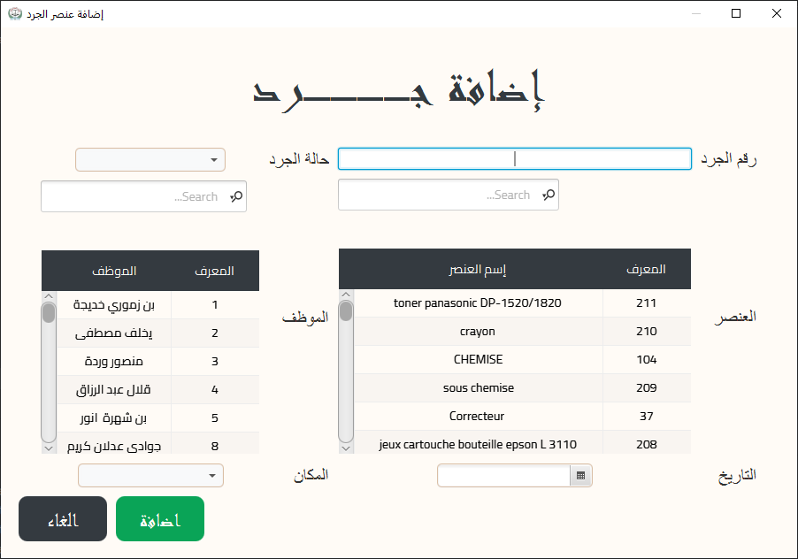
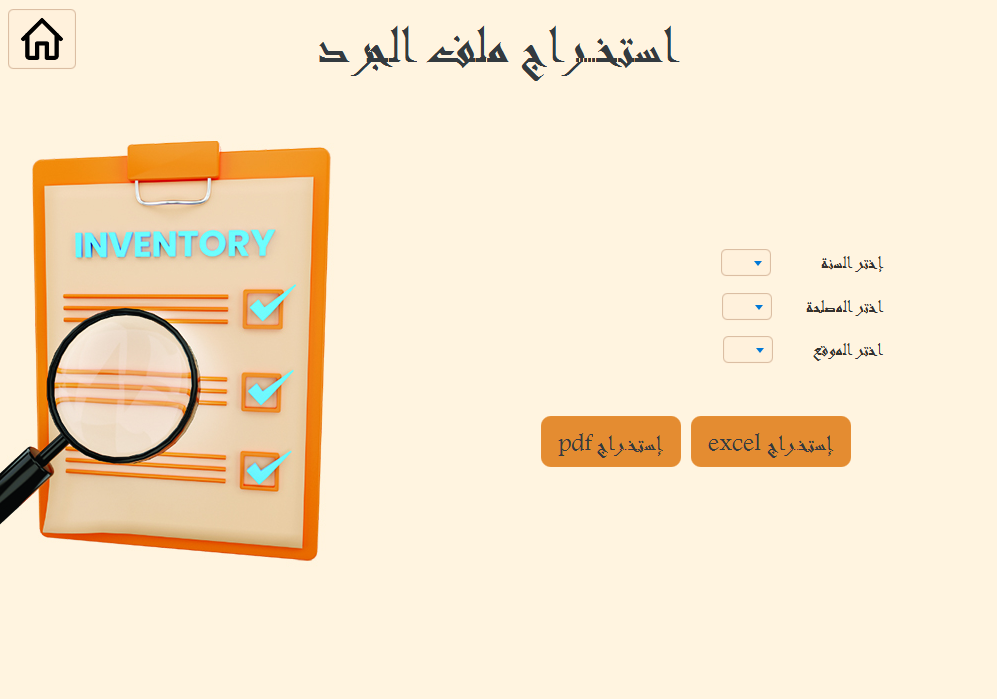
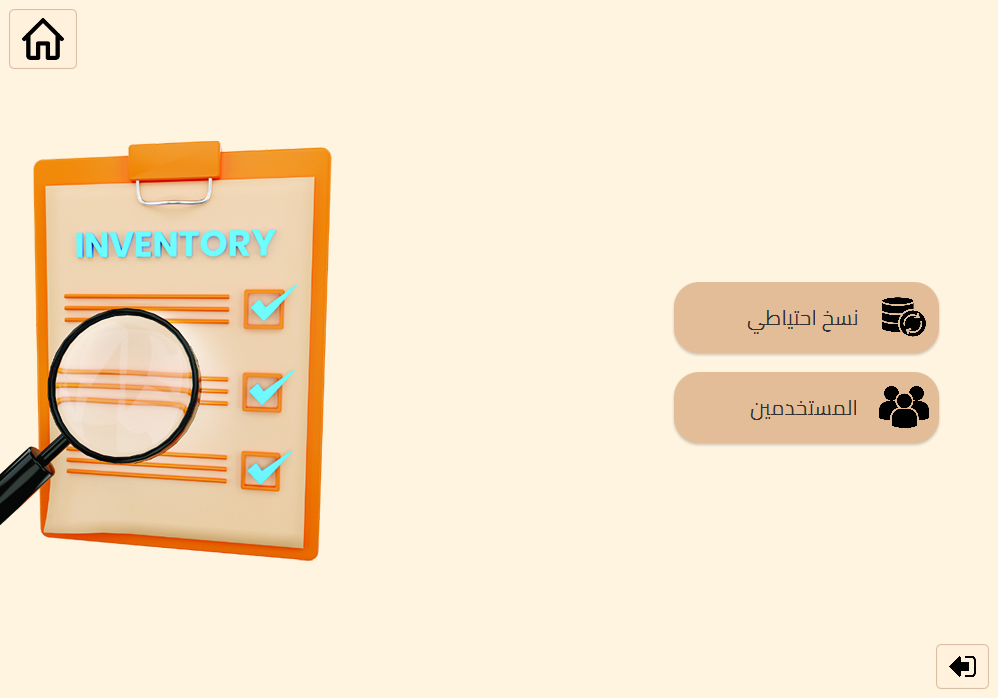

# **Inventaire ESM**

## Overview
**Inventaire ESM** is a desktop application developed using **JavaFX**, which helps manage inventory items effectively. The system allows users to track, add, update, and generate reports related to inventory data.

## Table of Contents
- [Overview](#overview)
- [Features](#features)
- [Technologies](#technologies)
- [Screenshots](#screenshots)
- [Installation](#installation)
- [Usage](#usage)
- [Development](#development)
- [License](#license)

## Features
- Manage inventory data (add, update, delete, and search items).
- Generate reports in **PDF** format using **JasperReports**.
- Export data to CSV and Excel formats.
- Barcode generation and scanning using **ZXing** library.
- JavaFX-based graphical user interface with **JFoenix** components.
- Multi-language support with **ICU4J** for localization.

## Technologies
- **JavaFX** for the front-end
- **MySQL** as the database
- **JasperReports** for generating PDF reports
- **JFoenix** for enhanced material design components
- **ZXing** for barcode generation
- **Apache POI** for Excel export
- **Log4j2** for logging

## Screenshots
Here are some screenshots of the application in action:

### 1. **Main Dashboard**

### 2. **Login**

### 3. **Add Bon Entree**

### 4. **Add Inventaire**

### 6. **Extract Inventaire**

### 7. **Inventaire View**

### 8. **Settings**

## Installation

### Prerequisites
- **Java JDK 21** or later.
- **Maven** 3.6 or later.
- **MySQL** server setup.

